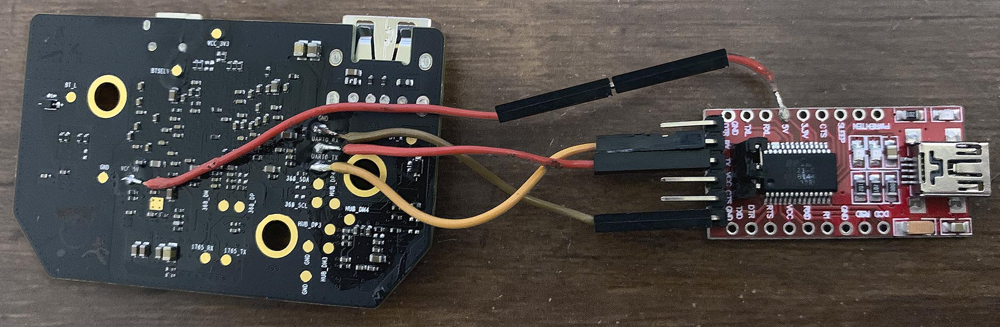
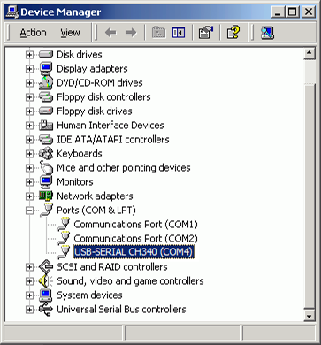
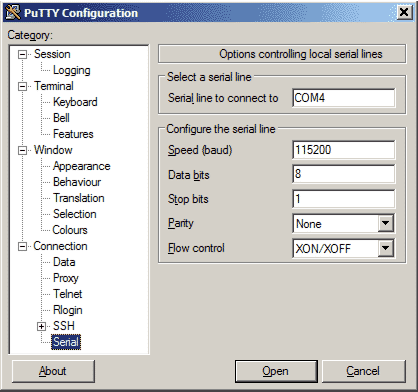
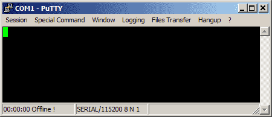

# Fixing flash programming in DM365 chip within GL300 remote controller

## Preamble

Here you will find not only instructions to blindly follow, but an explanation
of what you're really doing. Fixing is also preceded by diagnosis - this is
how all repairs should look like.

Electronics is not black magic, and it is not fixed by rituals. Some people
are sometimes able to fix their issues by a series of actions they don't
really understand, then announce their specific solution as universal cure.
This is not how any of this should work. It seem easier and faster, but it
is the dark side.

I hope this guide to give readers understanding of what they're doing.
Knowledge acquired here can be then used to fix different boards and
devices. All digital devices are very similar in how they work.

This guide was made with help from [@oemgpsnav](https://phantompilots.com/members/119969/).
It is also a result of previous cooperation with
[Mefistotelis from the OGs group](https://github.com/mefistotelis).
The [OGs wiki](https://github.com/o-gs/dji-firmware-tools/wiki) is
referenced heavily in this article and was the primary source of information
for it (I did contributed to that wiki a bit as well).

## Problem statement

This instruction concerns the following DJI Remote Controllers:

* _Phantom 3 Pro/Advanced_, the first release version, *GL300a* (the "a"
  at end is important)

* _Phantom 3 Pro/Advanced_, any version if you have HDMI output on your RC
  (*HMDI output board* in an upgrade compatible with all GL300 RCs)

* _Phantom 4 Standard_, if you have *HDMI output* on your RC (I don't really
  know if it applies to other versions of Phantom 4)

* _Inspire 1_ RC (*GL658A*)

The instruction shows how to diagnose and solve the following issue:

After connecting Mobile Device to the drone via USB-to-microUSB cable,
the mobile device does not react on the connection. Mobile device does
not find/recognize the RC.

We will assume the issue was verified to be caused by RC (by either trying
another RC which worked, or checking different cables and mobile devices
with the same issue appearing on all of them).

_If you need to diagnose the cause of your issue, do not just assume it's the
same as described here; to through the diagnosis graph to find your cause:
[Fix no video feed / black screen / no image transmission / no FPV on Ph3 Pro](https://phantompilots.com/threads/fix-no-video-feed-black-screen-no-image-transmission-no-fpv-on-ph3-pro.133487)_

## Preparations

First, remove the Interface Board from the RC. There is an instruction for that from OEM:  
[How to install HDMI Output Module on Phantom 3 Remote Controller](https://www.youtube.com/watch?v=fBt7FiH0mII)

Check the board from physical damage. You can use a multimeter to check
whether USB output pins are connected, and no capacitors are shorted.
If there are no indicators of physical damage the issue is probably
software-related. To be sure, we need to check whether the chip which
controls the board boots properly.

To further diagnose and fix the board, you will need:

* a temperature controlled *soldering iron*, and enough skill to solder wires
  to test points on the board

* a *USB-to-TTL* converter (also known by brand name - FTDI), which supports
  *3.3V logic* (note that if device claims it's "universal" but there's no
  jumper to switch to 3.3V, then it is crap and will not work)

* ability to use that converter from your PC (if you know what command line
  tools are or what a text terminal is, you should be ok)

* Good amperage USB output (ie. from a USB hub), or just *additional 5V power
  supply*; The USB standard of 500mA is the minimum power the board needs,
  and any drop below that will cause the chip to fail flashing. So it is
  better to use USB with high current rating (ie. 1A charging outputs).

The board consists of _Texas Instruments DM36x Media Controller chip_, and
additional chips needed for it to work: RAM chip, NAND chip and voltage
regulators. To get more info about this board, look at
[GL300 Interface board description by OGs](https://github.com/o-gs/dji-firmware-tools/wiki/GL300-Interface-board).

The _DM36x_ is a processor which runs Linux as operating system. We need
to hook to it and check whether Linux boots properly.

## Soldering to debug serial interface

We have our board out, and USB-to-TTL converter ready. Let's solder cables
to the test pads. What is a test pad? Those are the small copper dots on the
Printed Circuit Board - they are used during manufacturing to test whether
the board works as intended. The pads are named with white paint on most
boards; if your board doesn't have the white names, find the test pads
location on photos in "_GL300 Interface board description_" linked above.
It is best to solder detachable wires to the board; most USB-to-TTLs have
pin outputs on which you slide a cable, so this comes with the package.

To the soldering:

* At back of the Interface Board, you will see test pads marked "`GND`"
  and "`VCC_5V`", close to each other. Solder wires to these (you should
  be able to solder to any GND pad instead; but the one closest to VCC is
  the safest choice). Make sure you will [U]be able to easily
  connect/disconnect the 5V power supply[/U]. You will want to be able
  to reset your power while other pads are all connected.

* Also at back of the Interface Board, you will see test pads marked
  "`UART0_RX`" and "`UART0_TX`" (or "`368_RX`" and "`368_TX`", on some
  boards). Solder wires to these as well.

Now, connect everything:

* `GND` cable to GND pin of your USB-to-TTL; if you're using external power
  supply, connect GND to there as well (something may burn if both grounds
  are not floating; but today we mostly have floating grounds in devices,
  so it should be ok)

* `VCC_5V` cable <u>do not connect yet</u> - you will be connecting it to
  5V power supply, either from USB or external supply)

* `UART0_RX` cable to the TX pin of your USB-to-TTL, and `UART0_TX` cable
  to the RX pin. Yes, usually we connect RX-TX and TX-RX (*R* is for Receive
  and *T* is for Transmit; if something is transmitting, we want the other
  side to receive)

* plug your USB-to-TTL converter into a port from your PC; make sure to switch
  it to 3.3V logic, if it has a jumper for that



You may wonder why we use 3.3V logic, even though we're supplying the board
with 5V power. This is because the board is really supplying 3.3V to all the
chips - it converts the 5V at input to 3.3V before sending it anywhere further.

After you've connected the USB-to-TTL to your PC, it should've installed the
new device. In case of Windows you should've heard a sound queue and the device
appearing in _"Device Manager"_ under _"Ports"_, in case of Linux -
a device appearing as "`/dev/ttyUSB*`" and messages about its installation
being visible in "`dmesg`" output.



## Connecting to the debug serial interface

Connect to the USB-to-TTL device using a terminal application. For windows, use
[ExtraPuTTY](http://www.extraputty.com/); for Linux - either
[minicom](https://linux.die.net/man/1/minicom) or
[picocom](https://linux.die.net/man/8/picocom).



Set transmission configuration to 115200 8N1 (baud rate: 115200, data bits: 8,
parity: None, stop bits: 1) and connect to the proper serial device (the one
which appeared in _"Device Manager"_ or "`dmesg`").
You should see an empty window, with cursor only.



Everything is ready for a first boot.

## Booting the board with debug interface connected

Connect the 5V power pin to start booting the board. What you see on the
terminal screen determines the further steps.

Possible cases:

### 1. Magic Smoke escapes.

If this is what happens, please describe details so we could all have a laugh..
or maybe avoid your mistake.

### 2. Nothing happens. Still only cursor on screen.

In this case we can't be sure whether the DM36x doesn't print anything (which
indicates bootloader damage), or your serial connection is broken somehow.

Your setup, you need to test by yourself. Maybe RX and TX wires are switched?
Maybe your USB-to-TTL just doesn't work? If there's no apparent issue, you can
just assume it's bootloader damage. While fixing it, you will have another
opportunity to test the serial setup.

To fix bootloader damage - go to "_Re-flashing bootloader_" chapter below.

### 3. The terminal outputs something, but not readable text - just garbage.

This is a clear indication of your serial connection being incorrectly
configured. Make sure you use recommended terminal apps. Make sure
you've entered transmission params correctly.

The DM36x is sending out text, and something from your setup changes it into
garbage. Fix your setup.

### 4. The terminal outputs many lines of text.

This is what we expect from DM36x if bootloader is able to execute. You now
need to analyze the text to figure out if everything boots properly, and if
not - at which part it stops.

Go to "_Finding issues in logs from terminal_" chapter below.

After log are captured, you can disconnect the 5V power. In any of the cases
above, you may want to read "_Overview of the boot process_" chapter below to
get an understanding of the whole thing.

## Overview of the boot process

Booting of the DaVinci Linux on DM36x consists of the following parts:

### 1. Bootloader loads and selects a kernel to run

Bootloader is just a short program which prepares grounds for the Operating
System to load. On your PC, you have bootloader as well:

* if you're running Windows, it is the 
  [place where you can select between "normal boot" and "safe mode"](https://en.wikipedia.org/wiki/Windows_NT_6_startup_process),
  hidden unless there's an issue

* if you're running Linux, you probably see
  [GRUB](https://en.wikipedia.org/wiki/GNU_GRUB)
   menu at startup, where you can select older version of kernel to start;
  though there are many bootloaders to choose from

The DaVinci Linux uses [U-Boot](https://en.wikipedia.org/wiki/Das_U-Boot)
as its bootloader.

### 2. Kernel starts, initializes drivers for available hardware components

The messages from kernel are easy to spot, as they're preceded by time marking
in square brackets, ie. `[ 0.123456]`.

### 3. Kernel mounts root filesystem

This is technically part of kernel startup, but good to separate as a possible
point of failure. Until this point, the kernel had no access to any additional
files.

Now it prepares the mechanism to access files within the system - 
"[mounts](https://en.wikipedia.org/wiki/Mount_(computing))"
one of the partitions as root filesystem. Root filesystem is the base for
accessing everything within [UNIX compliant](https://en.wikipedia.org/wiki/Unix)
systems like Linux - not only normal files and folders, but also devices and
processes. The partition is using [UBI File System](https://en.wikipedia.org/wiki/UBIFS).

### 4. Application which decodes and routes data and video between the RC and Mobile Device starts

A few last lines of the booting process is just loading the application which
connects to [Cypress 68013](https://www.cypress.com/part/cy7c68013a-128axc)
chip within the RC, and acts as USB Master for the Mobile Device.
At this point, user can type commands to the Linux shell. The `stop` command
for example will terminate the application so that it stops spewing messages.

## Finding issues in logs from terminal

### 1. Bootloader issues

The first question we need to ask is whether U-Boot is working properly.
This is easy to check, as the main purpose of bootloader is to load kernel -
so if it is trying to load kernel, it is working.

And how do we know whether it tries to load kernel? Easy - if it does, it will
print the line:

```
Loading from nand0, offset 0x??????
```

The place where question marks are will contain offset from which the kernel
is tried; we're not interested in these yet. As long as a line like above
exists in logs, bootloader is working correctly.
If there's no such line, then you need to re-flash bootloader. Go to 
"_Re-flashing bootloader_" chapter below.

For reference, here are all the messages a bootloader has shown on a specific, fully working board:

```
DM36x initialization passed!
UBL Product Vesion : DJI-486M-UBL-1.0-rc0(2015-10-30)
Dji UBL Version: 1.51(Nov  2 2015 - 15:46:28)
Booting Catalog Boot Loader
BootMode = NAND
Starting NAND Copy...
Valid magicnum, 0xA1ACED66, found in block 0x00000019.
   DONE
Jumping to entry point at 0x81080000.

U-Boot Product Vesion : DJI-DEC-Uboot-1.0-rc0(2015-11-02)
U-Boot 2010.12-rc2-svn3214-Dji (Nov 02 2015 - 19:39:56)
Cores: ARM 486 MHz
DDR:   360 MHz
I2C:   ready
DRAM:  128 MiB
NAND:  128 MiB
Bad block table found at page 65472, version 0x01
Bad block table found at page 65408, version 0x01
*** Warning - bad CRC, using default environment

Net:   Ethernet PHY: GENERIC @ 0xff
DaVinci-EMAC
Press ESC to abort autoboot in 1 seconds

Loading from nand0, offset 0x4a0000
   Image Name:   Linux-2.6.32.17-davinci1
   Created:      2015-06-23   9:37:05 UTC
   Image Type:   ARM Linux Kernel Image (uncompressed)
   Data Size:    4065664 Bytes = 3.9 MiB
   Load Address: 80008000
   Entry Point:  80008000
## Booting kernel from Legacy Image at 80700000 ...
   Image Name:   Linux-2.6.32.17-davinci1
   Created:      2015-06-23   9:37:05 UTC
   Image Type:   ARM Linux Kernel Image (uncompressed)
   Data Size:    4065664 Bytes = 3.9 MiB
   Load Address: 80008000
   Entry Point:  80008000
   Loading Kernel Image ... OK
OK

Starting kernel ...
```

Note that `Bad block table found` in the log above doesn't mean anything wrong.
It just shows the place where tables which store bad blocks are located.

### 2. Kernel issues

So the bootlader is trying to load kernel. Now let's make sure it is succeeding
in the loading. If it does, then the bootloader work should end with
`Starting kernel ...` as above. But wait! There are two copies of the kernel
stored, and only one of these is proper, working kernel.
The other is a recovery kernel, used to make it easier to fix stuff in case
primary kernel dies. This recovery kernel can't correctly connect to the
Mobile Device.

To be sure a primary kernel is being loaded, make sure you don't see the
following lines in your logs:

```
ERROR: can't get kernel image!
```

Primary kernel resides at offset `0x4a0000` in the NAND memory, and recovery
kernel sits at `0x900000`. It is possible to have both kernel copies damaged -
in that case, you will see `can't get kernel image!` two times, and booting
will stop. If at least one kernel is valid, the bootloader will use it and
continue booting.

For reference, here are the messages a bootloader shows for a board which
has both copies of the kernel damaged:

```
Loading from nand0, offset 0x4a0000
** Unknown image type
Wrong Image Format for bootm command
ERROR: can't get kernel image!

Loading from nand0, offset 0x900000
** Unknown image type
Wrong Image Format for bootm command
ERROR: can't get kernel image!
Dji-Pro #
```

If any of the kernel copies is damaged, go to "Reflashing kernel" chapter
below. If primary kernel starts booting properly, let's look further into
the logs.

### 3. Encryption issues

The next possible point of failure is encryption initialization. There is a small encrypted partition within the NAND memory, and it is required for the encryption to initialize.
If that area is damaged, booting will stop(freeze forever) around the message:

```
[    ?.??????] encrypt device:atsha204 found
```

Sometimes the message might also be `encrypt device:at88 found`. Atmel AT88 is an older version of the ATSHA204 chip; GL300 remotes only use ATSHA204, but older drivers show both chips as AT88; it doesn't really matter which one is shown.
What matters is - if the booting freeze at some point and no more messages are logged, and within the last 20 lines there's the `encrypt device` message, then encrypted partition is probably damaged. Sometimes the freeze happens too fast for the line to print - in such case, the last line printed is one of below:

```
[    ?.??????] NET: Registered protocol family 17
[    ?.??????] lib80211: common routines for IEEE802.11 drivers
[    ?.??????] ksocket init
```

In any of above cases, go to "Re-flashing encrypted partition" chapter below.

### 4. Root filesystem issues

The next important part of booting is mounting the root filesystem. This happens soon after NAND device initialization, started by `NAND device` type announcement. It looks similar to lines below, though details may vary - DJI uses various NAND chips from several manufacturers:

```
[    0.570000] NAND device: Manufacturer ID: 0x2c, Chip ID: 0xf1 (Micron NAND 128MiB 3,3V 8-bit)
[    0.580000] Creating 4 MTD partitions on "davinci_nand.0":
```

If at some point after that message you see `UBI error` like:

```
[    0.800000] UBI error: ubi_io_read: error -74 while reading 512 bytes from PEB ???:2048, read 512 bytes
```

Or no filesystem was recognized at all with `No filesystem could mount root` message, like:
```
[    1.240000] No filesystem could mount root, tried:  cramfs vfat msdos
```

Then your root filesystem is probably damaged. The booting in such case will usually end with messages:

```
[    1.250000] Kernel panic - not syncing: VFS: Unable to mount root fs on unknown-block(1,0)
[    1.260000] Rebooting in 1 seconds..
```

But sometimes it will continue to spew hundreds of `UBI error` instead.
Go to "Re-flashing root filesystem" chapter below if any of this happens.

### 5. When all is good

Now, we've discussed many issues, but what if the device booted properly and is working as intended? How to recognize that?
Well in that case, the chip will continue to print messages after it's booted, at circa one second intervals. The messages may be:

```
DummyRead68013 0.000000kb
DummyRead68013 0.000000kb
```

or:

```
read 68013  return size = 0
read 68013  return size = 0
read 68013  return size = 0
read 68013  return size = 0
0kbps
```

If the messages above are not shown, but what you see doesn't match any of the described cases - you will have to ask someone proficient with Linux for help.
Before jumping to the chapter which described your issue, be sure to read "Downloading images and tools" below to get all the things you need to re-flash.

## Downloading images and tools

In case you'll be be flashing bootloader, you will need Serial Flasher Host Program from Texas Instruments.
Original releases of this tool are at [URL='http://arago-project.org/files/releases/']Arago Project Releases[/URL]. They were linked to at, now defuc, [URL='https://web.archive.org/web/20100525171208/http://processors.wiki.ti.com/index.php/DaVinci_GIT_Linux_Kernel_Releases']DaVinci GIT Linux Kernel Releases page[/URL]. The latest release which still supports the DM36x line is `davinci-psp_03.01.01.39`. Inside, there is `board-utils-davinci.tar.gz` which contain the file you seek - `sfh_DM36x.exe`.

You will also need the images to flash. They are listed on [URL='https://github.com/o-gs/dji-firmware-tools/wiki/Firmware-m1300#structure']the wiki page with structure of DaVinci firmware[/URL]; let's list them directly here:
* `ubl?.img` - stores U-Boot init code; first code which is being loaded while the board starts
* `u-boot.img` - U-Boot main (application) part; contains most of the bootloader
* `uImage` - the Primary Linux Kernel, normally used for booting
* `uImage_recovery` - the Linux Kernel which is used when primary kernel gets corrupted
* `dm365_secret.bin` - Encrypted partition for ATSHA204 initialization
* `ubifs-partition.ubi` - Linux Root Filesystem, using UbiFS

These are all the files you might need (though usually only one specific partition gets corrupted, so you only need one for your fix).

Where to get them:
* `ubl?.img`, `u-boot.img` and `uImage` are included in every firmware update, and can be extracted from there. I already did that and you can download them in this archive: [ATTACH]111454[/ATTACH]. There are files for different firmware versions inside; use the one closest to the version you have on your RC; or just latest one, if you're unsure. Despite the file name, those files are proper for both GL300 and GL658 remotes.
* `uImage_recovery` can be downloaded from [URL='https://github.com/o-gs/dji-firmware-tools/wiki/Flashing-firmware-on-DaVinci-media-processors#flashing-kernel']the OGs Wiki[/URL], though I would advise to just use a copy of `uImage` instead.
* `dm365_secret.bin` is really unique for every machine and can't be just downloaded; but if it prevents you from booting, it is damaged anyway; you can download a version which shouldn't prevent booting at [URL='https://github.com/o-gs/dji-firmware-tools/wiki/Flashing-firmware-on-DaVinci-media-processors#flashing-encrypted-partition']the OGs Wiki[/URL].
* `ubifs-partition.ubi` is a big partition, and most complicated one to fix; it also contains some machine-specific files, so don't reflash it unless it really is damaged; [URL='https://github.com/o-gs/dji-firmware-tools/wiki/Flashing-firmware-on-DaVinci-media-processors#flashing-root-filesystem']The OGs Wiki[/URL] has a link to it, too.

## Re-flashing bootloader

To re-flash bootloader, you first need to force the chip into serial programming mode. This will make the chip ignore content of NAND memory, and instead wait for commands on serial interface. To enter serial programming mode, solder the Boot Select service pad `BTSEL` to `3.3V` pad.

[ATTACH type="full" alt="flashing_dm36x_usb2ttl_soldering_bootloader.jpg"]111460[/ATTACH]

After the pads are shorted, connect the board to PC via USB-to-TTL, as before, and run PuTTY. When you connect `5V` power to the board, you should see repeating `BOOTME` messages on the terminal.

If you don't see them, something is wrong and you need to fix your setup. Find a way to test whether your USB-to-TTL works, check if all your connections look good and verify shorts with a multimeter. If everything seem OK and there is still no `BOOTME`, then your Interface Board probably is physically damaged - either power supply, or the chip itself, is fried. This can only be fixed by a technician using component level repair.

But usually you will be able to get `BOOTME` to show. And that means the chip is now waiting for commands from PC. Since we don't know how to type the commands by hand, we will use a tool which will do that for us - `sfh_DM36x.exe`.

Copy `sfh_DM36x.exe`, `u-boot_prop.img` and `ubl1_prop.img` to a directory with short path, for example `C:\tmp` on Windows. Open [URL='https://en.wikipedia.org/wiki/Shell_(computing)']shell window[/URL] in that folder. Close PuTTY. Execute the command below in the shell:

```
sfh_DM36x -nandflash -v -p "COM4" ubl1_prop.img u-boot_prop.img
```

The tool will show you messages sent by the board in lines starting with `Target:`. You've seen the initial message in PuTTY, so you should have already figured out you should see `Target: BOOTME` first. Then the tool will start talking to the board, and you will see a series of various messages.

For a complete log, see [URL='https://github.com/o-gs/dji-firmware-tools/wiki/Flashing-firmware-on-DaVinci-media-processors#flashing-u-boot-by-serial-port']u-boot flashing instructions at OGs Wiki[/URL].

Sometimes the tool starts listening at wrong place and isn't able to understand the first message, which prevents it from moving forward. If that happens, just stop its execution with [I]Ctrl+C[/I] and then re-run the exact same command again.

If everything went well, the final message will be:

```
Operation completed successfully.
```

If instead you see an error:

1. Make sure you've typed correct port

2. Make sure the path to execution folder is short, and all files have privileges to be read by everyone

3. Make sure your 5V power provides enough amperage for the board

4. Make sure cables connecting serial interface are short and good quality, and nothing near them generates interference

5. Read the error message carefully and draw conclusions from it; you may try googling it as well

It is possible that the NAND chip is completely damaged and just won't accept programming, but it is a rare case. Usually errors are caused by not following the instructions exactly.

After bootloader is re-flashed, disconnect the `BTSEL` pad and get back to chapter "Finding issues in logs from terminal" to verify whether the whole boot succeeds.

[U]Remember to unsolder the pad, otherwise you will continue seeing `BOOTME` only![/U]

## Re-flashing kernel

So either your primary or recovery kernel got damaged, and you want to re-flash it. Since you have a working bootloader, we can use it to do the flashing. Bootloaders usually have a simplistic [URL='https://en.wikipedia.org/wiki/Shell_(computing)']shell[/URL] which allows executing some basic commands without operating system. U-boot is no exception.

You've probably already noticed that after you connect the 5V power to your board with ExtraPuTTY connected, the first thing you see is `Press ESC to abort autoboot`. Do that - press `ESC`. You need to be fast. Instead of trying to boot kernel, U-boot will then drop to its shell:


```
Press ESC to abort autoboot in 1 seconds
Dji-Pro #
```

If you pressed `ESC` more than once, you may want to remove the additional stokes from buffer by just pressing `Enter`.

Now, we need a way to transfer our kernel file to the board. For that, we will use part of the RAM connected to the chip. We will first transfer the kernel to RAM, and from there, write it to NAND.

Let's select RAM address `0x80008000`. First, we need to clean it from garbage data:

```
mw.b 0x80008000 0xFF 0x460000
```

Now, we can transfer the kernel there. Command for initiating the transfer is:

```
loady 0x80008000 115200
```

The u-boot will answer with `Ready for binary (ymodem) download` message. Now, we have to use menus of ExtraPuTTY; click `File Transfer -> Ymodem -> Send` and select the file.
[ATTACH type="full" alt="flashing_dm36x_windows_kernel_transfer.png"]111455[/ATTACH]

The transfer shouldn't last more than 15 minutes. After it finishes, summary will de displayed, ending with:

```
## Total Size      = 0x003e09c0 = 4065728 Bytes
Dji-Pro #
```

If there is a failure information instead, retry the transfer. If issues continue, use shorter and better quality wires between the board and USB-to-TTL device.

After the transfer succeeds, it is time to write the new kernel to NAND array. Such arrays need to be erased before writing. Then you can save the data from RAM into it.

Note that the commands below modify content of the NAND according to parameters. Do not make a mistake when copying them, or you will damage the NAND programming even more!

If you're writing Primary Kernel, use the commands:

```
nand erase 0x04a0000 0x460000
nand write 0x80008000 0x04a0000 0x460000
```

If you're writing Recovery Kernel as well, follow that with these commands:

```
nand erase 0x0900000 0x460000
nand write 0x80008000 0x0900000 0x460000
```

Remember that if you reboot the board, your kernel is no longer in RAM - so you must repeat the whole transfer, not only NAND write commands.

If the NAND Write fails, make sure your board is powered with high enough amperage, and re-try a few times. The NAND is unusable only if writing both Primary and Recovery kernel fails - you really only need one.

After the kernel is re-flashed, reboot the board and get back to chapter "Finding issues in logs from terminal" to verify whether the whole boot succeeds.

## Re-flashing encrypted partition

The need to re-flash the encrypted partition is a rare case and I won't be describing it in detail. For instructions, see [URL='https://github.com/o-gs/dji-firmware-tools/wiki/Flashing-firmware-on-DaVinci-media-processors#flashing-encrypted-partition']encrypted partition flashing instructions at OGs Wiki[/URL].

## Re-flashing root filesystem

Usually UbiFS can fix any errors within its structure, so I won't be describing re-flashing it in detail. For instructions, see [URL='https://github.com/o-gs/dji-firmware-tools/wiki/Flashing-firmware-on-DaVinci-media-processors#flashing-root-filesystem']root filesystem flashing instructions at OGs Wiki[/URL].

## The end

That concludes the guide. Hopefully you have a working mobile phone link on your GL300 remote controller now.
