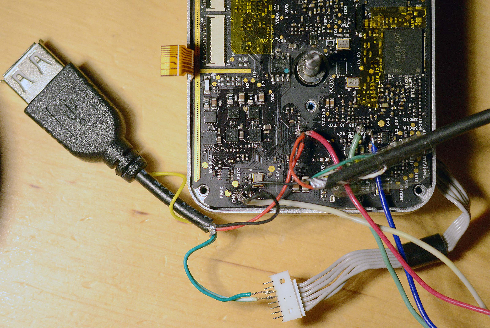

# Replacing flash chip in DM365 chip within Phantom 3 Pro gimbal

## Problem statement

I had a _Phantom 3 Pro_ gimbal which didn't allowed me to see the FPV feed.
Photos and movies were recorded on sd-card, there was just no live video -
only grey background - in Dji Go.

## Finding the faulty board

By connecting another gimbal, I narrowed down the problem to gimbal itself -
a different gimbal (which had the same firmware installed) worked fine.

_If you need to diagnose the cause of your issue, do not just assume it's
the same as described here; to through the diagnosis graph to find your cause:
[Fix no video feed / black screen / no image transmission / no FPV on Ph3 Pro](phantom-3-no-video-feed-black-screen-diagnose-and-fix.md)_

## Finding the faulty processor

Then I disassembled the gimbal. I looked at available information about the board:

[OGs Wiki - WM320 Gimbal top board](https://github.com/mefistotelis/phantom-firmware-tools/wiki/WM320-Gimbal-top-board)

On the schematic, video feed is encoded by media processor model DM365:

[OGs Dji Hardware Schematics: Phantom 3 Pro overview](https://github.com/o-gs/dji-hardware-schematics/blob/master/phantom_3_pro_overview/phantom_3_pro_overview.pdf)

To check whether the media processor is working correctly, I tapped to UART
interface of the DM365 chip with TTL-to-USB converter (aka FTDI). See here
for details:

[OGs wiki - Firmware module m0800 interfaces](https://github.com/mefistotelis/phantom-firmware-tools/wiki/Firmware-m0800#interfaces)

## Checking why it does not boot

I opened PuTTY on the interface before connecting 5V power for the board, then
connected the power. There was no output on the console while the board was
booting. But the board was booting - I was able to see the diode blinking
on it. Which means either my FTDI configuration was bad, or the chip just
wasn't producing any output.

To check which is true (and also fix the issue if this turns out to be a chip
boot issue), I shorted the boot pins to 3.3V and connected the board
to PC again. This should cause the DM365 chip to boot internally, without use
of NAND. This time I was able to see a series of "BOOTME BOOTME BOOTME"
messages. This ment my FTDI configuration is fine, the DM365 chip really wasn't
printing anything when trying to boot from NAND.

Here is the NAND chip with number "3" drawn on it:


## First try at flashing

If DM365 chip isn't printing anything, then the bootloader on NAND is damaged.
I tried flashing the bootloader using instructions from here:

[OGs wiki - Flashing firmware on DaVinci media processors](https://github.com/mefistotelis/phantom-firmware-tools/wiki/Flashing-firmware-on-DaVinci-media-processors#flashing-u-boot-by-serial-port)

But I wasn't able to flash the image. Flashing was ending with message about failure to open NAND:

```
Waiting for SFT on the DM36x...
        Target: Starting UART Boot...
        Target: BOOTUBL
BOOTUBL commmand received. Returning CMD and command...
CMD value sent.  Waiting for DONE...
        Target:    DONE
DONE received. Command was accepted.
Sending the UBL image
Waiting for SENDIMG sequence...
        Target: NAND_open() failed!Starting UART Boot...
        Target: BOOTUBL
```

Conclusion - The NAND chip is either not touching the board correctly and
needs re-flowing the solder, or is damaged and needs replacing.

## Tries at re-flowing

I gathered a cheapest BGA soldering equipment I could find:


With the equipment received from China, I went to action. I used heat-resistant
tape to shield the components around NAND. First I tried heating-up the
NAND chip and re-flowing it, but nothing changed - still "`NAND_open() failed`".
Then I heated it up again and gently pressed the chip, to make any smaller
solder balls connect. Unfortunately, that connected too much - the chip became
a short, and caused the whole FTDI to disconnect because of high current draw.
I tried heating up the chip even more to make it wiggle and re-form the solder
balls, but couldn't do this - the chip is so large that it won't dance under
the hot air, and the ultra-cheap soldering station won't allow me to increase
the air flow enoughly.

## Replacing the NAND chip

So I bought a few replacement NAND chips in China. Removed the old chip,
cleaned the pads with wick, put a little soldering paste on it and soldered
a new chip, placing it very carefully to the white outline of the chip visible
on the board.


It's good the chips came with solder balls already attached - it would make
soldering much harder if I had to solder the balls to the chip myself.

## Flashing the bootloader

With the new NAND, when I connected the board back to PC - I was able to write
bootloader to the flash. It worked! I had to do several tries though, because
my cables were a bit too long, and because my USB port couldn't deliver enough
(over 700mA @5V) power. Here is my flashing configuration:


After the bootloader was flashed, I disconnected the green cable which was causing it to boot internally and spew BOOTME:


Without this cable, the chip should get back to trying to boot from NAND.
I connected it back to PC to check whether bootloader works. And it does!


The NAND still lacks operating system, but it now works.

## Preparing to flash from SD-card

Since transferring large images over serial is slow and prone to errors,
I soldered female USB port to the board, so that I can connect SD-card reader
to DaVinci Linux. The port is working - I was able to transfer the kernel
through it, based on the instructions here:

[OGs wiki - Flashing firmware on DaVinci media processors, kernel via USB](https://github.com/mefistotelis/phantom-firmware-tools/wiki/Flashing-firmware-on-DaVinci-media-processors#loading-kernel-via-usb-stick)

Here is the photo of the gimbal board with port attached:



To avoid damaging the ribbon cable which connects gimbal to OFDM, I soldered
the USB data cables to a pin socket with 1.25mm spacing I bough in china.
As seen on the photo, the socket has 8 pins and the cable plug has only 6 -
but I was able to plug it without issues.

Though it looks like only on some boards the USB is easy to start.
If it doesn't want to work, it is better to just use serial - the root
filesystem image is small enough to fit on ramdisk while the recovery
system is started (the OGs wiki describes how to prepare a recovery system).

## Getting partition images to flash

The wiki now contains downloads of all firmware partitions for the Gimbal Top board:

[OGs wiki - Flashing firmware on DaVinci media processors](https://github.com/mefistotelis/phantom-firmware-tools/wiki/Flashing-firmware-on-DaVinci-media-processors)

Well, to be exact, all besides the partitions which are part of every firmware
update. But these can be easily extracted from any of the firmware updates:

```
./dji_fwcon.py -vvv -x -p P3X_FW_V01.07.0060.bin
openssl des3 -d -k Dji123456 -in P3X_FW_V01.07.0060_m0800.bin  -out P3X_FW_V01.07.0060_m0800_decrypted.tar.gz
tar -zxf P3X_FW_V01.07.0060_m0800_decrypted.tar.gz
```

After the files are extracted, `dji/data/uImage` file can be just flashed
directly as primary kernel, and u-boot partitions need one more operation:

```
dd if=dji/data/u-boot.img of=u-boot_prop.img bs=2048 skip=1
dd if=dji/data/ubl_297m_1.img of=ubl_297m_1_prop.img bs=2048 skip=1
```

So the commands above, plus the downloads from OGs wiki, gave me the complete
set of partitions:

* two u-boot images (`u-boot_prop.img` and `ubl_297m_1_prop.img`)

* primary kernel (`uImage`)

* recovery kernel (`uImage_recovery`)

* secret partition (`dm365_secret.bin`)

* root filesystem (`dm365_root_ubifs.ubi`)

## Flashing all the partitions

I wrote all the images as instructed on the OGs wiki.
Only root filesystem is a bit tricky - it is written in a different way
than other images, and also it is the largest image.
Not too large though - transferring it over serial shouldn't take more
than 2 hours (I was able to use USB, so the transfer was very fast).

Step-by-step instruction of flashing the partitions in Remote Controller board is available here:


## First boot of the new OS

After everything has been flashed, the board started rebooting continuously
due to no connection to OFDM board:

```
DM36x initialization passed!
UBL Product Vesion : DJI-297M-UBL-1.0-rc0(2015-10-30)
Dji UBL Version: 1.51(Nov  2 2015 - 15:45:39)
Booting Catalog Boot Loader
BootMode = NAND
Starting NAND Copy...
Valid magicnum, 0xA1ACED66, found in block 0x00000019.
   DONE
Jumping to entry point at 0x81080000.

U-Boot Product Vesion : DJI-ENC-Uboot-1.0-rc0(2015-11-02)
U-Boot 2010.12-rc2-svn3205-Dji (Nov 02 2015 - 19:07:26)
Cores: ARM 297 MHz
DDR:   270 MHz
I2C:   ready
DRAM:  128 MiB
NAND:  128 MiB
MMC:   davinci: 0
Bad block table found at page 65472, version 0x01
Bad block table found at page 65408, version 0x01
*** Warning - bad CRC, using default environment

Net:   Ethernet PHY: GENERIC @ 0xff
DaVinci-EMAC
Press ESC to abort autoboot in 1 seconds

Loading from nand0, offset 0x4a0000
** Unknown image type
Wrong Image Format for bootm command
ERROR: can't get kernel image!

Loading from nand0, offset 0x900000
   Image Name:   Linux-2.6.32.17-davinci1
   Created:      2015-03-30   9:54:39 UTC
   Image Type:   ARM Linux Kernel Image (uncompressed)
   Data Size:    4032832 Bytes = 3.8 MiB
   Load Address: 80008000
   Entry Point:  80008000
## Booting kernel from Legacy Image at 80700000 ...
   Image Name:   Linux-2.6.32.17-davinci1
   Created:      2015-03-30   9:54:39 UTC
   Image Type:   ARM Linux Kernel Image (uncompressed)
   Data Size:    4032832 Bytes = 3.8 MiB
   Load Address: 80008000
   Entry Point:  80008000
   Loading Kernel Image ... OK
OK

Starting kernel ...

[    0.000000] Kernel Product Vesion : DJI-NOHDMI-WM610-Kernel-1.0-rc6(2015-03-30)
[    0.000000] Linux version 2.6.32.17-davinci1 (root@dji) (gcc version 4.3.3 (Sourcery G++ Lite 2009q1-203) ) #16 PREEMPT Mon Mar 30 17:54:38 HKT 2015
[    0.000000] CPU: ARM926EJ-S [41069265] revision 5 (ARMv5TEJ), cr=00053177
[    0.000000] CPU: VIVT data cache, VIVT instruction cache
[    0.000000] Machine: DaVinci DM36x EVM
[    0.000000] Memory policy: ECC disabled, Data cache writeback
[    0.000000] DaVinci dm36x_rev1.2 variant 0x8
[...]
[    7.650000] usbcore: registered new interface driver usb_68013
[    7.680000] usb 68013 module init ok
sulogin: no password entry for root
login[453]: root login on 'ttyS0'

#Process /etc/profile...
root@Dji-Pro:~#

encode_usb V00.02.02.00(Nov  3 2015 11:23:52).
Entry Encrypt qury mode
Init libusb  faild!
Auto to detect v[   10.050000] EVM: switch to ambarella video input
ideo input type:
Default video input selected:Hdmi_yuv
Setting video standard to: 0x100000000000000
Capture input set to Hdmi[   10.060000] davinci_resizer davinci_resizer.2: RSZ_G_CONFIG:0:1:124
_yuv:11
[   10.070000] davinci_previewer davinci_previewer.2: ipipe_set_preview_config
[   10.080000] vpfe-capture vpfe-capture: IPIPE Chained
[   10.080000] vpfe-capture vpfe-capture: Resizer present
Capture videoStd[   10.090000] EVM: switch to ambarella video input
Old=0000000b
[   10.090000] vpfe-capture vpfe-capture: width = 1280, height = 720, bpp = 1
[   10.100000] vpfe-capture vpfe-capture: adjusted width = 1280, height = 720, bpp = 1, bytesperline = 1280, sizeimage = 1382400
[   10.110000] vpfe-capture vpfe-capture: width = 1280, height = 720, bpp = 1
[   10.120000] vpfe-capture vpfe-capture: adjusted width = 1280, height = 720, bpp = 1, bytesperline = 1280, sizeimage = 1382400
videoFrameRate=30000, width=1280, height=720
Venc1.c : minNumOutBufs 2, minOutBufSize[0] 1382400, minOutBufSize[1] 800
GOP interval:30, outBufSize:1382400, enAdpBW:1, airRate=0, slice=6, VUI=4,timeScale=60001
osdThrFxn: process ID is 458 ***********
watchdog timeout:5
ctrlThrFxn: process ID is 450 ***********
Frmae:1 Pslice = 0, Islice = 8[44ms]
GetFPGAstatus err!
FPGA[1,0,1,0]-1.000000:0
hdmi status is 1
usblink status check~~~~~~~~~~~~~~~~
GetFPGAstatus err!!
inptVD=0547
No USB device ID:547
try reset 68013....!
ARM Load: 61% Video fps: 4 fps Video bit rate: 0 kbps PHY Bandwidth: 0 kbps Time: 00:00:02 Resolution: 1280x720

GetFPGAstatus err!
FPGA[1,0,1,0]-1.000000:0
hdmi status is 1
ARM Load: 2% Video fps: 0 fps Video bit rate: 0 kbps PHY Bandwidth: 0 kbps Time: 00:00:04 Resolution: 1280x720

GetFPGAstatus err!
FPGA[1,0,1,0]-1.000000:0
hdmi status is 1
usblink status check~~~~~~~~~~~~~~~~
GetFPGAstatus err!!
inptVD=0547
No USB device ID:547
try reset 68013....!
ARM Load: 5% Video fps: 3 fps Video bit rate: 0 kbps PHY Bandwidth: 0 kbps Time: 00:00:05 Resolution: 1280x720

GetFPGAstatus err!
FPGA[1,0,1,0]-1.000000:0
hdmi status is 1
usblink status check~~~~~~~~~~~~~~~~
GetFPGAstatus err!!
inptVD=0547
No USB device ID:547
try reset 68013....!
ARM Load: 9% Video fps: 7 fps Video bit rate: 0 kbps PHY Bandwidth: 0 kbps Time: 00:00:07 Resolution: 1280x720

umount: can't remount none read-only
umount: mdev busy - remounted read-only

The system is going down NOW!

Sent SIGTERM to all processes

Sent SIGKILL to all processes

Requesting system reboot
```

I reassembled the gimbal, tested it, and (after two more partial
re-assemblies due to my mistakes) - everything started working.

FPV video on tablet is restored.

## My FPV is now choppy, at 8 FPS

After re-flashing all partitions on the NAND from Phantom 3, First Person View
video quality will degrade to 8 Frames Per Second.

A few people contacted me about this issue which happens after replacing
the NAND chip in the way I described. Live feed on the mobile device
comes back, but is choppy - works only at 8 frames per second.

The issue was diagnosed as related to SHA204 chip which provides encryption
capabilities. The chip is generally unused, but when encryption mismatch
is detected, it re-tries the encryption tests over and over, consuming
big chunk of processing power which would otherwise be used for video encoding.

Recently a tool was published which can be used to modify DM365 firmware
and remove re-tries mechanism, bringing FPV back to full rate.
The tool is here:
[OGs Dji Firmware Tools - dm3xx_encode_usb_hardcoder](https://github.com/o-gs/dji-firmware-tools#dm3xx_encode_usb_hardcoderpy)

A few popular versions of P3X firmware have the modified files already
generated in this archive:
[P3X_FW_fix_for_encrypt_8fps-v4.7z](https://mega.nz/#!oE9RzC6Z!Nadjx1-0KmKe02HSpMSz_xzDSpHMdW0oCuqo6gpwNoQ)

There is some info on how to use these files in README within that archive,
but it lacks details. Thanks to cooperation with [@GUCCI40](https://phantompilots.com/members/111172/),
we have a detailed instruction of using this archive to fix the 8fps issue:

1. rename proper .elf file to `encode_usb` (with no extension)

2. start the board with serial connected and "_PuTTY Extra_" opened

3. when the board ends booting, type in the shell:

```stop```

4. move to a directory where you can write files without issues, ie.:

```cd /tmp```

5. type in the shell:

```
lrz --ymodem –b
```

and in "_PuTTY Extra_" menu select the file to transfer

6. wait for the transfer; the file will be written in current directory.
Check whether the file is there with `ls -a`.

7. make backup of original `encode_usb` by typing in shell:

```
mv /opt/dji/bin/encode_usb /opt/dji/bin/encode_usb.bkp
```

8. move the file transferred over yModem at its place by typing in shell:

```
mv ./encode_usb /opt/dji/bin/encode_usb
```

9. mark the new file as executable by typing in shell:

```
chmod a+x /opt/dji/bin/encode_usb
```

That's it - if no errors were shown after the commands, 8fps issue is fixed.


## The end

That concludes this story. Hopefully you will be able to restore the NAND chip
in a similar manner I described.
