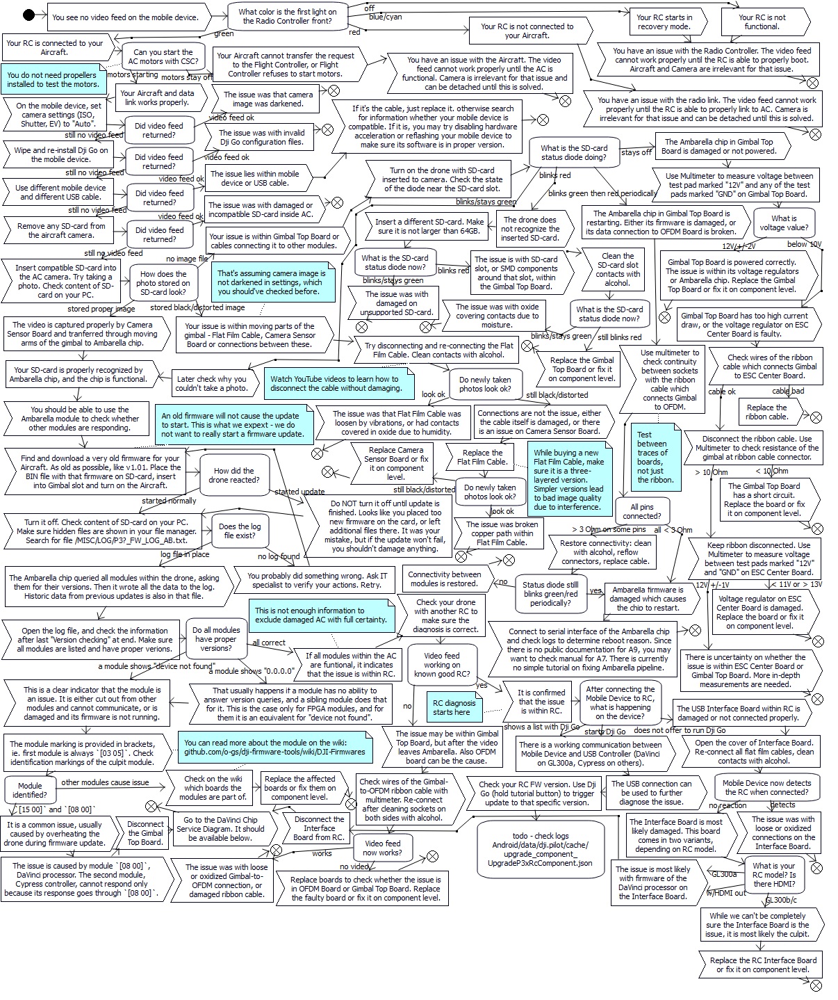

# Fix no video feed / black screen / no image transmission / no FPV on Ph3 Pro

Here is the diagram for diagnosing and fixing the most popular issue with
_Phantom 3 Professional_. The solution will also work fine for _Ph3 Advanced_
(though some branches are unreachable on this platform).

The diagram is oriented towards users who do not have a second drone to
interchange parts, or advanced equipment. The use of such items is delayed
in the graph as much as possible, though it is unavoidable at some point.
A repair shop would use different approach, testing components by replacing
them with known good ones as one of first steps.

Video Feed Service Diagram:

[SPOILER=DaVinci diagnosis diagram and links]
Here is the graph for fixing DaVinci media processor, referenced in Video
Feed Service Diagram. If any of the instructions is too vague for you,
check the links below the diagram - they contain more detailed explanations
for specific actions.

DaVinci Chip Service Diagram:
[IMG]https://phantompilots.com/media/ph3-pro-davinci-service-diagram-v2.4328/full[/IMG]

Beginner level instruction on re-flashing bootloader on NAND for DaVinci
processor in gimbal:
[No image transmission signal - P3P - SunsetCatcher's guide](https://phantompilots.com/threads/no-image-transmission-signal-p3p.116019/page-3#post-1261767)

Beginner level instruction on diagnosing and re-flashing partitions on NAND
for DaVinci processor in RC:
[Fixing flash programming in DM365 chip within GL300 remote controller](davinci-manual-flash-firmware-in-gl300-rc.md)

Generic guide on flashing all partitions on NAND for DaVinci processor:
[o-gs/dji-firmware-tools Wiki: Flashing firmware on DaVinci media processors](https://github.com/o-gs/dji-firmware-tools/wiki/Flashing-firmware-on-DaVinci-media-processors)

Replacing NAND chip for DaVinci processor:
[Fixing flash in DM365 chip within Ph3 Pro gimbal](https://phantompilots.com/threads/fixing-flash-in-dm365-chip-within-ph3-pro-gimbal.127310/)
[/SPOILER]

I can't remember all of RC diagnosis, so it's done only partially on the chart.

If I missed any typical cause, or you think something should be different -
please write. Same if you're stuck in a step and no answers match what you see.

I hope this will be the place to direct anyone with this kind of issue.

Links to more info below.

Simple drawing of the connections within the drone where video signal travels:
[Video transmission overview in Ph3 Pro/Adv](https://phantompilots.com/threads/camera-to-fried-gimbal-board-bypass.122240/#post-1248760)

Detailed explanation of retrieving the `/MISC/LOG/P3?_FW_LOG_AB.txt`:
[What is and how to get LOG_AB file](https://phantompilots.com/threads/need-advice-on-firmware.118813/#post-1217799)
Explanation of how to read with understanding each line of the LOG_AB file:
[How to read the P3X fw update log file](https://phantompilots.com/threads/how-to-read-the-the-p3x-fw-log-file.151510/#post-1509656)

Description of firmware modules, which chip they program and which board they're on:
[o-gs/dji-firmware-tools Wiki: Dji Firmwares](https://github.com/o-gs/dji-firmware-tools/wiki/DJI-Firmwares)

Board descriptions, useful for component level repairs:
[o-gs/dji-firmware-tools Wiki: Dji Hardware](https://github.com/o-gs/dji-firmware-tools/wiki/DJI-Hardware#phantom-3-proadv)
